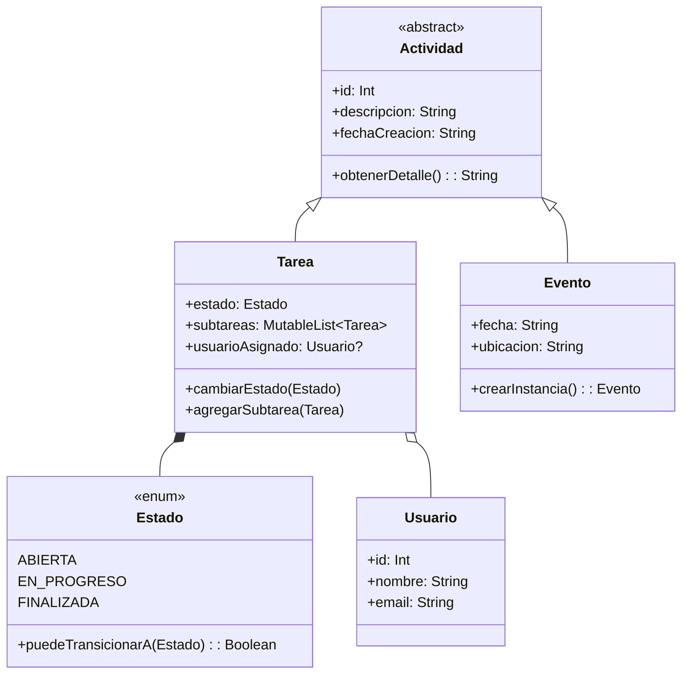

# Anotaciones sobre el debugging en el código

## 1. Problemas Identificados y Correcciones

### Error #1: Constructor de `Tarea` inconsistente

```kotlin
class Tarea(
    id: Int,
    descripcion: String,
    var estado: Estado = Estado.ABIERTA
) : Actividad(id.toString(), descripcion)
```

**Problema:**  
La clase `Actividad` espera `(descripcion: String, descripcion1: String)`, pero `Tarea` intenta pasar `id.toString()` como primer parámetro. Además, hay un posible error tipográfico en el uso de `Evento` en el `companion object`.

**Solución propuesta:**

```kotlin
class Tarea(descripcion: String) : Actividad(descripcion, descripcion) {
    var estado: Estado = Estado.ABIERTA
    // Resto del código...
}
```

---

### Error #2: Método `crearTarea()` en `ActividadService`

```kotlin
fun crearTarea(descripcion: String) {
    val tarea = Tarea.crearInstancia() // <- Método no existe
    actividadRepo.agregarTarea(tarea)
    return tarea
}
```

**Problema:**  
El método `crearInstancia()` no existe en `Tarea`.

**Solución:**

```kotlin
fun crearTarea(descripcion: String): Tarea {
    val tarea = Tarea(descripcion)
    actividadRepo.agregarTarea(tarea)
    return tarea
}
```

---

## 2. Depuración con IntelliJ IDEA

### Breakpoints y Logging

Ejemplo de logging en `ActividadService`:

```kotlin
private val logger = Logger.getLogger(ActividadService::class.java.name)

fun crearEvento(descripcion: String, fecha: String, ubicacion: String): Evento {
    logger.info("Creando evento: $descripcion")
    val evento = Evento.crearInstancia(descripcion, fecha, ubicacion)
    actividadRepo.agregarEvento(evento)
    logger.info("Evento creado con ID: ${evento.id}")
    return evento
}
```

**Breakpoints clave:**

- Línea donde se crea una `Tarea` (`ActividadService.crearTarea()`).
- Validaciones en `Tarea.cambiarEstado()`.

**Panel de Variables:**  
Inspecciona `estado` y `usuarioAsignado` para rastrear transiciones y asignaciones.

---

## 3. Mejoras Implementadas

### Validación de Estados en `Tarea`

```kotlin
fun cambiarEstado(nuevoEstado: Estado) {
    require(estado.puedeTransicionarA(nuevoEstado)) { 
        "Error: No se puede cambiar de $estado a $nuevoEstado" 
    }
    estado = nuevoEstado
}
```

**Logging asociado:**

```kotlin
logger.warning("Intento de transición inválida: $estado -> $nuevoEstado")
```

### Nuevo método en `ActividadService`

```kotlin
fun listarTareasPendientes(): List<Tarea> {
    return actividadRepo.obtenerTodos()
        .filterIsInstance<Tarea>()
        .filter { it.estado != Estado.FINALIZADA }
}
```

---

## 4. Documentación del Proceso

### Incidencia 1:
**Descripción:** Error al crear tarea por constructor mal definido.  
**Evidencia:**
```plaintext
ERROR: java.lang.IllegalArgumentException: La descripcion debe contener texto.
```
**Solución:** Corregir la herencia de `Tarea` y `Actividad`.

### Incidencia 2:
**Descripción:** Transición de estado no válida en `Tarea`.  
**Evidencia:**
```plaintext
WARNING: Intento de transición inválida: FINALIZADA -> EN_PROGRESO
```
**Solución:** Usar `Estado.puedeTransicionarA()` para validar.

---

## 5. Pruebas y Resultados

### Caso de Prueba 1: Crear Evento

```kotlin
val evento = actividadService.crearEvento(
    "Reunión", 
    "01-01-2023", 
    "Oficina"
)
```

**Log esperado:**

```plaintext
INFO: Evento creado con ID: 202301011
```

### Caso de Prueba 2: Cambiar Estado de Tarea

```kotlin
tarea.cambiarEstado(Estado.EN_PROGRESO)  // Válido
tarea.cambiarEstado(Estado.FINALIZADA)   // Válido
tarea.cambiarEstado(Estado.ABIERTA)      // Inválido (log de warning)
```


---

## 6. Diagrama de Clases (Resumen)




---

## 7. Cómo Ejecutar el Proyecto

1. Clona el repositorio.
2. Abre el proyecto en **IntelliJ IDEA**.
3. Ejecuta `main()` desde `Main.kt`.
4. Usa el menú en consola para interactuar con el sistema.

---

## 8. Conclusión

- **Logging:** Esencial para rastrear errores en tiempo real.
- **Breakpoints:** Útiles para inspeccionar el flujo del programa.
- **Validaciones:** Mejoran la robustez general (especialmente en `Tarea`).  
